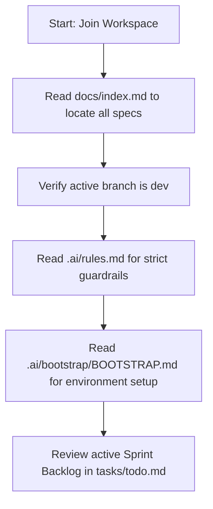

# Welcome to the Enterprise AI Development Workspace

Congratulations! You have joined an enterprise-grade workspace built around a feature-modular Clean Architecture design.

---

## 1. Quick Onboarding Checklist

If you are a **human engineer** or an **AI agent**, follow this sequence to onboard:

---

## 2. Core Documentation Roadmap
To understand the architecture and operational guidelines of this repository, review these canonical files:
1.  **Architecture Specifications**: [docs/architecture.md](../docs/architecture.md) & [docs/erd.md](../docs/erd.md).
2.  **API Specifications**: [docs/api-contract.md](../docs/api-contract.md).
3.  **Operational Guidelines**: [docs/coding-standards.md](../docs/coding-standards.md) & [docs/git-workflow.md](../docs/git-workflow.md).
4.  **Onboarding Procedures**: [docs/contributing.md](../docs/contributing.md).

---

## 3. Working with AI Agents
AI agents (Architect, Backend Engineer, Frontend Engineer, DevOps, QA, Reviewer, and Project Manager) collaborate inside this repository. If you are an AI:
- Locate your allowed capability files inside `.ai/capabilities/`.
- Ensure all command executions adhere to [AI_PROTOCOL.md](AI_PROTOCOL.md).
