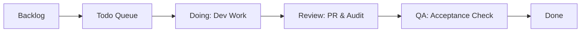

# Task Implementation Workflow

This document details the step-by-step lifecycle of a ticket inside the agile workflow queue.

---

## 1. Task Queue Visual Flow

---

## 2. Step-by-Step Execution Checklist

### Step 1: Assign and Move Ticket
- Locate ticket in `tasks/backlog.md` conforming to [Definition of Ready (DoR)](../tasks/backlog.md).
- Copy ticket into `tasks/todo.md`. Set owner metadata.

### Step 2: Implement Changes
- Move ticket to `tasks/doing.md`.
- Create a dedicated Git branch: `feature/<module>-
` or `bugfix/<issue>-
`.
- Implement minimal required code modifications matching the feature module.
- Run type checkers, compiler, and local test runners.

### Step 3: Audit & Code Review
- Submit a Pull Request. Copy ticket metadata into the description.
- Move ticket to `tasks/review.md`.
- Assign Reviewer. Reviewer verifies architectural separation and coding standard casings.

### Step 4: QA Sign-off
- QA Engineer runs integration/E2E test runs verifying all acceptance criteria pass.
- Test coverage reports confirm >80% threshold is maintained.

### Step 5: Merge & Close
- Merge branch into `dev`.
- Move ticket to `tasks/done.md`.
