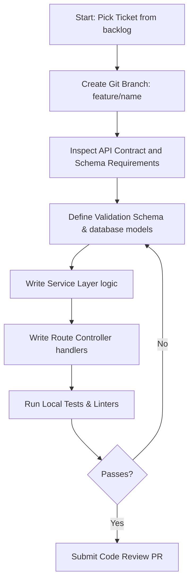

# AI Developer Workflow: Backend Feature Implementation

This document describes the standard enterprise workflow for implementing a new backend API feature.

---

## Workflow Sequence

---

## Steps & Checklists

### 1. Pre-Implementation Checklist
- [ ] Read the active ticket requirements in `tasks/todo.md`.
- [ ] Open the API Contract to inspect endpoints and responses.
- [ ] Review the ERD/relational model documentation for table mappings.

### 2. Implementation Pipeline
1.  **Validation Definitions**: Create/update payload schemas (validate request params, query filters, and body payload).
2.  **Repository Actions**: Implement queries inside repository wrapper files using database client calls.
3.  **Service Actions**:
    -   Write business logic inside service wrapper files.
    -   Enforce authorization and permission rules.
    -   Throw custom application errors when operations fail.
4.  **Routing & Controllers**:
    -   Map routes with validation and auth middlewares.
    -   Format return envelope inside controllers.

### 3. Verification & Compliance
- [ ] Run compiler check-ins and type check scripts.
- [ ] Run local test suites and verify coverage is maintained.
- [ ] Run code formatters and linters.