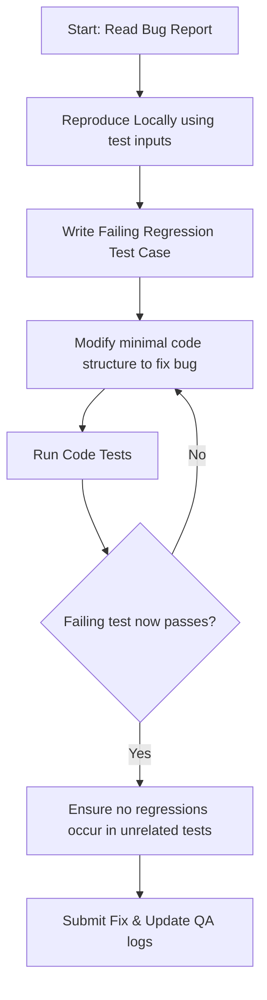

# AI Developer Workflow: Bug Fixing

This document details the workflow for triaging, fixing, and verifying software defects.

---

## Workflow Sequence

---

## Steps & Checklists

### 1. Verification & Analysis
- [ ] Read the issue description using the [Bug Report template](file:///d:/01. Projects/AI Workspace/mini-trello/templates/bug-report-template.md).
- [ ] Trace execution logs or print outputs to identify where variables deviate from expected results.

### 2. Implementation & Test-driven Resolution
1.  **Write Failing Spec**: Add a test block inside the corresponding test suite matching the exact payload or parameters that caused the crash. Verify that the test fails.
2.  **Surgically Fix**: Modify the minimum lines in the controllers, database calls, or state logic. Do not combine other cleanup changes or style improvements with a hotfix.
3.  **Validate Fix**: Run test suites locally to verify the new test passes and check that all historical tests remain green.

### 3. Log Verification
- [ ] Document changes in detail inside the pull request description.
- [ ] Reference the issue card ID and tag the QA Engineer for testing.
