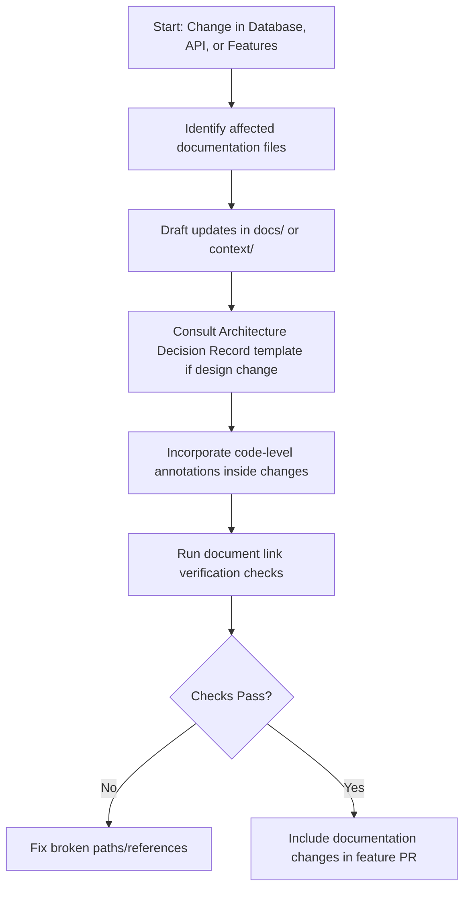

# AI Developer Workflow: Documentation Lifecycle

This document defines the process for creating, modifying, and syncing technical, architectural, and API documentation files inside the workspace.

---

## Workflow Sequence

---

## Steps & Checklists

### 1. Identify Context Gaps
Whenever code mutations occur:
- [ ] If a database table field is added/changed -> Update the ERD schema models and Database Context.
- [ ] If an API endpoint path, query parameter, or response payload schema is modified -> Update the API Contract and API Context.
- [ ] If architectural layers or library packages are added -> Update Architecture details and Tech Stack configs.

### 2. Standardize ADRs
When choosing libraries, structuring tables, or altering design patterns:
- [ ] Use the ADR Template to record the decision.
- [ ] Append the ADR number and context inside the decisions document.

### 3. Maintain Code Level Comments
- [ ] Keep code-level annotations on all controllers, services, and repository functions up-to-date.
- [ ] Keep validation properties commented with validation parameters.
