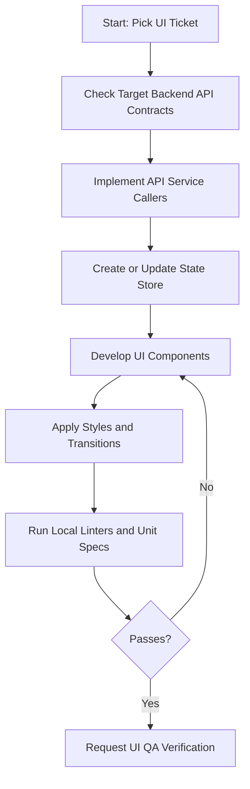

# AI Developer Workflow: Frontend Feature Implementation

This document describes the standard workflow for implementing a new frontend UI or state feature.

---

## Workflow Sequence

---

## Steps & Checklists

### 1. Planning Phase
- [ ] Inspect the layout rules inside the Frontend Context document.
- [ ] Inspect corresponding data responses in the API Contract document.

### 2. State & Client Mapping
1.  **Service Clients**: Add HTTP methods inside services directories using the custom client wrapper.
2.  **State Stores**:
    -   Expose actions to query services, mutate loading states, and update local state arrays.
    -   Expose getters to compute and sort UI view states.

### 3. UI Composition & Styling
1.  **Component Writing**: Write modular, reusable presentation component nodes. Use strictly-typed interface parameters.
2.  **CSS Styling**:
    -   Define component styles, transitions, and hover keyframes.
    -   Ensure proper focus, disabled, and active states are defined for all form inputs.

### 4. Verification Check
- [ ] Run development server and verify rendering responsiveness.
- [ ] Verify console is free of warnings and runtime errors.
- [ ] Run linters and format check scripts.
- [ ] Run component and store unit test specs.
