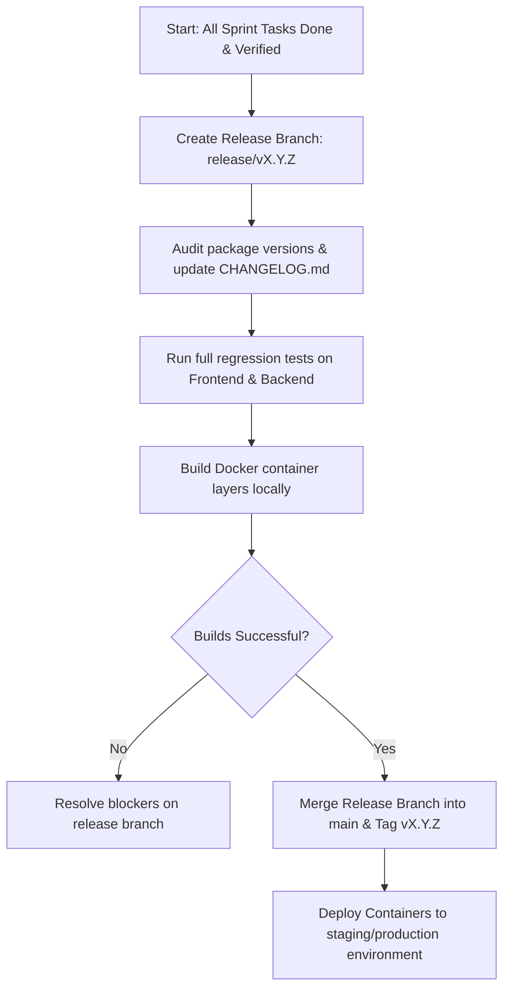

# AI Developer Workflow: Release & Versioning

This document describes the pipeline for compiling, tagging, and releasing stable versions of the application.

---

## Workflow Sequence

---

## Release Checklist

### 1. Pre-Release Verification
- [ ] Verify that the backlog sprint goals are 100% complete and all tickets reside in `done.md`.
- [ ] Confirm QA Engineer signature on integration test runs.
- [ ] Review risk registers to verify no blocker items remain open.

### 2. Versioning & Configuration
- [ ] Bump version numbers in package configurations (Semantic Versioning: Major.Minor.Patch).
- [ ] Compile release changelog.
- [ ] Verify environment templates are in sync with config schemas.

### 3. Containerization Verification
- [ ] Execute Docker Compose configurations locally to verify build health.
- [ ] Perform basic smoke test queries against database and server ports.

### 4. Deploy Trigger
- [ ] Merge to main branch.
- [ ] Tag the commit with `vX.Y.Z` version tags.
- [ ] Monitor CI/CD action runners to confirm packages are built and uploaded.
