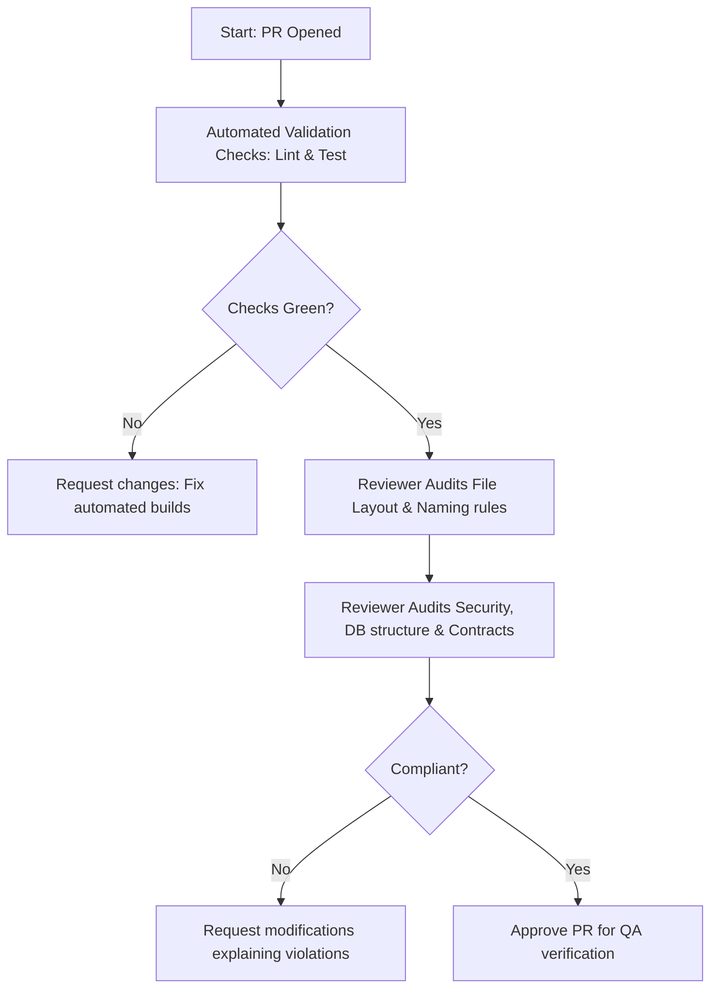

# AI Developer Workflow: Code Review (PR Auditing)

This document describes the review process required for all code contributions.

---

## Workflow Sequence

---

## Code Review Standard Checklist

### 1. Architectural Integrity
- [ ] Code files reside in correct module layouts. No mixing of concerns.
- [ ] Layered hierarchy is respected: Routes/Views -> Controllers -> Services -> Repositories.
- [ ] Database interactions go through the Repository wrapper.

### 2. Typings & Code Quality
- [ ] Strictly typed. No bypass configurations or use of `any` types.
- [ ] Code complexity is low (functions under 30 lines, nested conditionals minimized).
- [ ] Variables, classes, and methods follow [Coding Standards](file:///d:/01. Projects/AI Workspace/mini-trello/docs/coding-standards.md) naming rules.

### 3. API Contract Alignment
- [ ] URLs, parameter positions, HTTP verbs, and query variables match [API Contract](file:///d:/01. Projects/AI Workspace/mini-trello/docs/api-contract.md).
- [ ] Responses are mapped inside the correct success `{ success: true, data }` or error `{ success: false, error }` envelopes.

### 4. Database & Performance Audit
- [ ] All database queries are indexed correctly.
- [ ] No database operations run inside iteration loops (N+1 queries).
- [ ] Foreign keys cascade deletes appropriately.

### 5. Security Check
- [ ] Access controls (token verification middleware) guard protected routes.
- [ ] Inputs are sanitized and bound to queries (SQL injection prevention).
- [ ] No hardcoded configuration values or keys.
