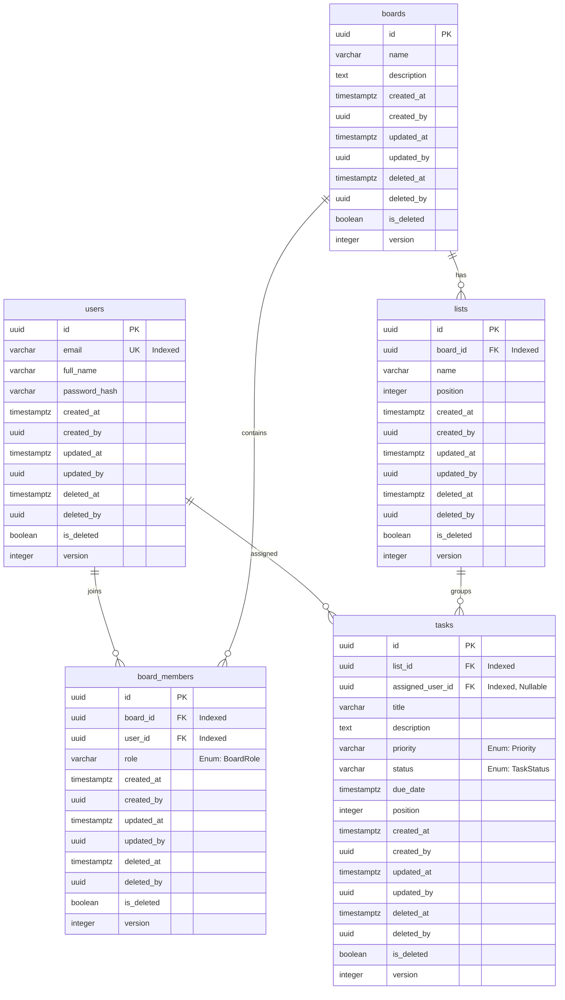

# Enterprise Relational Database Design & Domain Model (MVP)

| Metadata | Value |
| :--- | :--- |
| **Owner** | Principal Software Architect / Solution Architect |
| **Reviewer** | Enterprise DB Architecture Reviewer |
| **Status** | Approved |
| **Version** | 1.0 |
| **Last Updated** | 2026-07-09 |
| **Review Date** | 2026-07-09 |
| **Dependencies** | [Architecture Specification](architecture.md) |
| **Referenced By** | [Canonical Document Index](index.md), [Prisma Schema](../backend/prisma/schema.prisma) |
| **Document Type** | Relational Database Design |
| **Audience** | Development Team, DevOps Team, AI Agents, DBA Team |

---

## 1. Executive Summary & Design Methodology

This document details the simplified MVP database design for the AI Workspace (mini-trello) system. 

Adhering to a **Domain-First Design** approach, this specification begins with the core business domain entities and relationships, transitions to logical architectures, and concludes with physical database designs.

The physical mapping target is **PostgreSQL**, leveraging robust relational constraints, custom indexes, soft-delete mechanisms, and optimistic concurrency locks. This model is constructed to be ORM-agnostic, ensuring 100% compatibility with **Prisma ORM**, **Entity Framework Core**, **Laravel Eloquent**, and **SQLAlchemy** without modifying the core business invariants.

---

## 2. Naming Conventions

To ensure multi-framework compatibility and clean database operations, the following rules apply:
- **Entity Names (Domain)**: Singular `PascalCase` (e.g., `User`, `BoardMember`, `List`, `Task`).
- **Table Names (Database)**: Plural `snake_case` (e.g., `users`, `board_members`, `lists`, `tasks`).
- **Column Names (Database)**: `snake_case` (e.g., `created_at`, `is_deleted`). Mapped to `camelCase` in application/ORM code.
- **Primary Keys**: Always named exactly `id` and typed as `UUID`.
- **Foreign Keys**: Named as `singular_referenced_table_id` (e.g., `board_id`, `user_id`, `list_id`).
- **Booleans**: Prefixed with `is_` (e.g., `is_deleted`).
- **DateTimes**: Suffixed with `_at` (e.g., `created_at`, `deleted_at`).

---

## 3. Auditable Entity Standard

To maintain rigorous enterprise auditing and compliance, all business tables inherit a standard audit model. Definitions are defined here once and inherited by every physical database table.

### 3.1 Logical Audit Columns

| Field Name (ORM) | Column Name (DB) | Type | Nullability | Description |
| :--- | :--- | :--- | :---: | :--- |
| `id` | `id` | UUID | NOT NULL | Primary key (auto-generated v4 UUID). |
| `createdAt` | `created_at` | TIMESTAMPTZ | NOT NULL | Timestamp of record creation. |
| `createdBy` | `created_by` | UUID | NULL | User ID who created the record (Null for system-level actions). |
| `updatedAt` | `updated_at` | TIMESTAMPTZ | NOT NULL | Timestamp of last modification. |
| `updatedBy` | `updated_by` | UUID | NULL | User ID who last modified the record. |
| `deletedAt` | `deleted_at` | TIMESTAMPTZ | NULL | Timestamp of soft-deletion. |
| `deletedBy` | `deleted_by` | UUID | NULL | User ID who performed soft-deletion. |
| `isDeleted` | `is_deleted` | BOOLEAN | NOT NULL | Soft-delete flag. Defaults to `FALSE`. |
| `version` | `version` | INTEGER | NOT NULL | Version tracking number for optimistic concurrency. Defaults to `1`. |

---

## 4. Business Domain Model

The business domain consists of a clean hierarchy where Users collaborate on Boards, which contain organized Lists, holding Tasks.

```
  [User]
    │
    ├─── joins (1:N via BoardMember) ───► [Board] ─── contains (1:N) ───► [List]
    │                                                                        │
    │                                                                   contains (1:N)
    │                                                                        │
    │                                                                        ▼
    └──────── assigned to (1:1 direct) ───────────────────────────────► [Task]
```

### 4.1 Domain Entities
1. **User**: Represents individuals authenticated to access the application.
2. **Board**: A specific project planning/tracking board.
3. **BoardMember**: Connects Users directly to Boards with granular permission levels.
4. **List**: A category (list column) tracking tasks on a Board.
5. **Task**: A specific work card containing priorities, status, and deadlines.

### 4.2 Entity Relationships & Cardinalities
- **User 1 ── 0..N BoardMember**: A user can join multiple boards.
- **Board 1 ── 1..N BoardMember**: A board has members (at least one owner).
- **Board 1 ── 0..N List**: A board contains zero or more lists.
- **List 1 ── 0..N Task**: A list groups zero or more tasks.
- **User 1 ── 0..N Task**: A user can be assigned to multiple tasks.
- **Task 0..1 ── 1..1 User**: A task can optionally be assigned to one user.

---

## 5. Entity Relationship Diagram (ERD)

Below is the complete relational model for the MVP.



---

## 6. Enum Strategy

To enforce type-safety and data consistency across application layers, the database utilizes string-backed enum types.

### 6.1 `Priority`
Used to prioritize tasks.
- `LOW`: Low urgency tasks.
- `MEDIUM`: Standard operational tasks.
- `HIGH`: Fast-tracked items.
- `URGENT`: Immediate blocker resolution required.

### 6.2 `TaskStatus`
Tracks the lifecycle of a task card.
- `TODO`: Backlog / Task defined but not started.
- `IN_PROGRESS`: Work is actively being done.
- `DONE`: Successfully completed task.

### 6.3 `BoardRole`
Defines operational permissions inside a board.
- `OWNER`: Full board administration and destruction rights.
- `EDITOR`: Full write permissions to manage lists, tasks, and assignments.
- `MEMBER`: Ability to edit tasks they are assigned to.
- `VIEWER`: Read-only board layout monitoring.

---

## 7. Physical Database Design

This section details the physical PostgreSQL table schemas. Note that each table **implicitly inherits** the nine fields defined in **Section 3: Auditable Entity Standard** (i.e. `id`, `created_at`, `created_by`, `updated_at`, `updated_by`, `deleted_at`, `deleted_by`, `is_deleted`, `version`).

### 7.1 Table: `users`
Represents the user credentials and profile records.

| Column | Type | Constraints | Description |
| :--- | :--- | :--- | :--- |
| `email` | VARCHAR(255) | NOT NULL, UNIQUE | User email address. |
| `full_name` | VARCHAR(100) | NOT NULL | Display full name. |
| `password_hash` | VARCHAR(255) | NOT NULL | Argon2 / bcrypt hashed password string. |

### 7.2 Table: `boards`
A single tracking board.

| Column | Type | Constraints | Description |
| :--- | :--- | :--- | :--- |
| `name` | VARCHAR(100) | NOT NULL | Name of the board. |
| `description` | TEXT | NULL | Details about the board. |

### 7.3 Table: `board_members`
Links users to boards.

| Column | Type | Constraints | Description |
| :--- | :--- | :--- | :--- |
| `board_id` | UUID | NOT NULL, FK -> `boards(id)` | Parent board. |
| `user_id` | UUID | NOT NULL, FK -> `users(id)` | Authorized board user. |
| `role` | VARCHAR(50) | NOT NULL, DEFAULT 'MEMBER' | Member permissions (Enum: `BoardRole`). |

### 7.4 Table: `lists`
A vertical list categorizing tasks.

| Column | Type | Constraints | Description |
| :--- | :--- | :--- | :--- |
| `board_id` | UUID | NOT NULL, FK -> `boards(id)` | Parent board. |
| `name` | VARCHAR(100) | NOT NULL | Title of the list (e.g. "Sprint Backlog"). |
| `position` | INT | NOT NULL, DEFAULT 0 | Ordering index for lists on the board. |

### 7.5 Table: `tasks`
A leaf item representing a single task.

| Column | Type | Constraints | Description |
| :--- | :--- | :--- | :--- |
| `list_id` | UUID | NOT NULL, FK -> `lists(id)` | Parent list category. |
| `assigned_user_id` | UUID | NULL, FK -> `users(id)` | Assigned user (Single assignee). |
| `title` | VARCHAR(255) | NOT NULL | Summary title. |
| `description` | TEXT | NULL | Details and description. |
| `priority` | VARCHAR(50) | NOT NULL, DEFAULT 'MEDIUM' | Urgency of task (Enum: `Priority`). |
| `status` | VARCHAR(50) | NOT NULL, DEFAULT 'TODO' | Task workflow lifecycle (Enum: `TaskStatus`). |
| `due_date` | TIMESTAMPTZ | NULL | Target completion deadline. |
| `position` | INT | NOT NULL, DEFAULT 0 | Sorting sequence within the parent list. |

---

## 8. Index & Constraint Strategy

An enterprise-level indexing structure is crucial to prevent table scans and support fast query resolutions. PostgreSQL utilizes partial indexes to ignore soft-deleted rows.

### 8.1 Index Recommendations

| Table | Index Name | Type | Key Columns | Filter Condition | Purpose |
| :--- | :--- | :--- | :--- | :--- | :--- |
| `users` | `idx_users_email_active` | Unique | `email` | `WHERE is_deleted = false` | Authenticating active user email addresses. |
| `board_members` | `idx_board_mbrs_compound` | Unique | `board_id`, `user_id` | `WHERE is_deleted = false` | Prevents duplicate board memberships. |
| `board_members` | `idx_board_mbrs_user` | B-Tree | `user_id` | `WHERE is_deleted = false` | Listing private boards a user belongs to. |
| `lists` | `idx_lists_board_order` | B-Tree | `board_id`, `position` | `WHERE is_deleted = false` | Fast sorting of lists inside a board. |
| `tasks` | `idx_tasks_list_order` | B-Tree | `list_id`, `position` | `WHERE is_deleted = false` | Fetching ordered task cards inside a list. |
| `tasks` | `idx_tasks_assigned_user` | B-Tree | `assigned_user_id` | `WHERE is_deleted = false` | Querying all active tasks assigned to a specific user. |
| `tasks` | `idx_tasks_search` | GIN | `to_tsvector('english', title)` | `WHERE is_deleted = false` | Full-text query searching of task titles. |

---

## 9. Integrity & Cascade Policies

To maintain data sanity without risking accidental cascade purges of transaction records, a hybrid constraint policy is implemented.

### 9.1 Cascade Rule Matrix

| Relationship | Cascade Rule | Business Rationale |
| :--- | :--- | :--- |
| `Board` ── `BoardMember` | **CASCADE DELETE** | Board memberships cannot exist without a parent board. |
| `Board` ── `List` | **CASCADE DELETE** | Lists are components of a board; deleting the board removes the lists. |
| `List` ── `Task` | **CASCADE DELETE** | Tasks reside inside lists; deleting the list removes its tasks. |
| `User` ── `BoardMember` | **RESTRICT** | Hard deletions of users are prevented if they own active boards (need ownership transfer first). |
| `User` ── `Task` (assigned) | **SET NULL** | If a user is physically purged, their assigned tasks remain but `assigned_user_id` becomes null. |

---

## 10. Soft Delete Policy

In an enterprise environment, raw `DELETE` operations are dangerous and result in data loss. This system implements a soft-delete architecture.

### 10.1 Filter Strategy
- **Application Queries**: Every default SELECT query must include `is_deleted = FALSE` (or `isDeleted: false` in Prisma/EF Core).
- **Unique Constraints**: Unique indexes (e.g. `users.email`) are built as partial indexes: `CREATE UNIQUE INDEX idx_users_email_active ON users(email) WHERE is_deleted = false;`. This permits a user to register with an email that was previously used and soft-deleted.

### 10.2 Cascade Propagation in Soft Delete
- If a `Board` is soft-deleted, the application service recursively sets `is_deleted = true`, `deleted_at = NOW()`, and `deleted_by = :actor_id` on its child `lists` and `tasks`.

### 10.3 Restoration Strategy
- Soft-deleted entities can be restored by:
  1. Flipping `is_deleted = false` and setting `deleted_at = NULL` / `deleted_by = NULL`.
  2. Incrementing the `version` field.
  3. Optionally restoring nested child elements (e.g. restoring a board can restore its lists and tasks).

### 10.4 Purge Strategy (Data Retention)
- A scheduled database cron task (e.g., pg_cron or worker job) runs daily:
  `DELETE FROM tasks WHERE is_deleted = true AND deleted_at < NOW() - INTERVAL '30 days';`
- This ensures a 30-day "recycle bin" buffer before permanent data destruction.

---

## 11. Concurrency & Versioning

To prevent race conditions (lost updates) when multiple users edit task details concurrently, the database uses **Optimistic Concurrency Control (OCC)**.

### 11.1 The `version` Field
- Every record is initialized with `version = 1`.
- When an update statement executes, the application must query the record version, then verify the version matches during writing:
  ```sql
  UPDATE tasks 
  SET title = :new_title, version = version + 1, updated_at = NOW()
  WHERE id = :id AND version = :expected_version AND is_deleted = false;
  ```
- If the query returns 0 rows updated, a concurrency conflict is detected. The application throws a `ConcurrencyConflictException` prompting the user to refresh their client UI.

### 11.2 API Support
- For HTTP REST routes, the version integer maps to the `ETag` header or a metadata parameter in JSON payload.
- API PUT requests include `If-Match: W/"<version>"` to enforce transaction validation rules.

---

## 12. Future Enhancements

The following modules, concepts, and features are reserved for future phases of the project:

1. **Workspace & WorkspaceMember**: Ability to group multiple boards under corporate or team containers.
2. **UserSession & Refresh Tokens**: Explicit session history tracking and secure token rotators.
3. **TaskAssignment (Multiple Assignees)**: Transitioning from a 1:1 `assigned_user_id` to a join table `task_assignments` supporting multiple assignees per task card.
4. **Comments & Attachments**: Adding discussion threads (`task_comments` table) and file attachments (`task_attachments` table) per task card.
5. **Labels / Tags**: Master labeling system to group task cards across boards.
6. **UserPreference & Dashboard Widgets**: Layout settings, filters, and dashboard widget lists.
7. **Domain Events**: Event-sourcing hooks like `BoardCreated`, `TaskMoved`, and `TaskCompleted` to power notifications, webhooks, and analytics.
8. **Checklists**: Nested checklists inside task cards.
9. **Time Tracking**: Track hours logged on each task.
10. **Watchers**: Subscribing to updates on specific tasks.
11. **Notifications**: Push/email updates for task assignment or activity changes.

---

## 13. Future ORM Mapping Guide

This design uses standard, standards-compliant, and predictable database conventions. The table below maps SQL concepts to respective ORM capabilities.

| Relational Concept | Prisma | EF Core | Laravel Eloquent | SQLAlchemy |
| :--- | :--- | :--- | :--- | :--- |
| **UUID PK** | `@id @default(uuid())` | `.HasDefaultValueSql("gen_random_uuid()")` | `HasUuids` trait | `postgresql.UUID(as_uuid=True)` |
| **Soft Delete** | Middleware / Extensions filter queries | `.HasQueryFilter(e => !e.IsDeleted)` | `use SoftDeletes;` | Custom event listener filters |
| **Audit Fields** | `@updatedAt` / `@default(now())` | Configured via `ChangeTracker` interceptor | `const CREATED_AT` / `const UPDATED_AT` | `default=datetime.now`, `onupdate` |
| **Optimistic Concurrency** | `@version` (custom interceptor) | `.IsRowVersion()` or `[ConcurrencyCheck]` | Custom save method handler | `version_id_col` parameter in mapper |