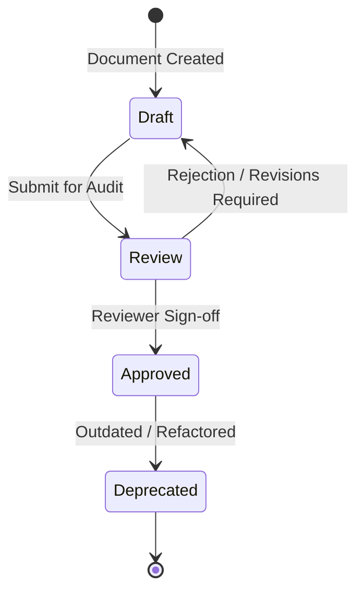

# Project Governance & Documentation Lifecycle - Generic Template

| Metadata | Value |
| :--- | :--- |
| **Owner** | Project Manager |
| **Reviewer** | Principal Software Architect |
| **Status** | Approved |
| **Version** | v1.1.0 |
| **Last Updated** | 2026-07-09 |
| **Review Date** | 2026-07-09 |
| **Dependencies** | None |
| **Referenced By** | [Canonical Document Index](index.md), [README](../README.md) |
| **Document Type** | Governance Standard |
| **Audience** | Development Team, QA Team, AI Agents |

---

## 1. Documentation Lifecycle Model

Every technical, architectural, or project specification document in this workspace must undergo a strict lifecycle:

### 1.1 Document States
- **Draft**: Initial creation by owner. Subject to modifications. Not to be used as a source of truth by AI agents.
- **Review**: Open for reviewer comments, links checking, and compatibility audits.
- **Approved**: Verified and frozen. Serves as the canonical source of truth.
- **Deprecated**: Replaced by newer specs. Retained for historical record.

---

## 2. Documentation Ownership Matrix

This matrix assigns responsibility for editing, updating, and signing off on canonical repository documentation:

| Document | Owner | Reviewer | Update Trigger | Target Audience |
| :--- | :--- | :--- | :--- | :--- |
| [Requirements Specification](requirements.md) | Project Manager | Architect | Requirement Change | Development & QA |
| [Architecture Specification](architecture.md) | Architect | Reviewer | Architectural Shift | Development |
| [Database Schema (ERD)](erd.md) | Architect | DevOps | Database Field Change | Dev & DevOps |
| [REST API Contract](api-contract.md) | Architect | Reviewer | Route Payload Shift | Dev & QA |
| [Coding Standards](coding-standards.md) | Architect | Reviewer | Lint Rule Change | Dev & Reviewer |
| [Maturity Model](maturity-model.md) | Architect | Reviewer | Project Phase Swap | All Teams |

---

## 3. RACI Matrix

The RACI matrix defines responsibility roles for core development activities:

| Activity | PM | Architect | Backend | Frontend | Reviewer | QA | DevOps |
| :--- | :---: | :---: | :---: | :---: | :---: | :---: | :---: |
| **Requirements Specification** | **A** | **C** | **I** | **I** | **I** | **C** | **I** |
| **API Contract & Database Design** | **I** | **A** | **C** | **C** | **C** | **I** | **C** |
| **Backend Code Implementation** | **I** | **C** | **R** | **I** | **C** | **I** | **I** |
| **Frontend UI Implementation** | **I** | **C** | **I** | **R** | **C** | **I** | **I** |
| **Quality Gate Verification** | **I** | **I** | **I** | **I** | **C** | **R** | **I** |
| **Code Review Auditing** | **I** | **C** | **I** | **I** | **R** | **I** | **I** |
| **Migrations & Deployment** | **I** | **C** | **I** | **I** | **I** | **I** | **R** |
| **Release Management** | **A** | **C** | **I** | **I** | **I** | **C** | **R** |

*R = Responsible, A = Accountable, C = Consulted, I = Informed.*

---

## 4. Canonical Documentation Rules
To prevent duplication and documentation drift:
1.  **Single Source of Truth**: Key technical areas exist only once in canonical documents:
    -   **Architecture**: Governed inside [architecture.md](architecture.md).
    -   **Relational Schema (ERD)**: Governed inside [erd.md](erd.md).
    -   **API Endpoints & Contracts**: Governed inside [api-contract.md](api-contract.md).
    -   **Security Guidelines**: Governed inside [security.md](security.md).
    -   **Testing Protocols**: Governed inside [testing.md](testing.md).
2.  **References Only**: No other file in the repository (including AI Contexts, Sprint backlog logs, or task cards) may define or repeat these schemas or configurations. They must reference these canonical files instead.

